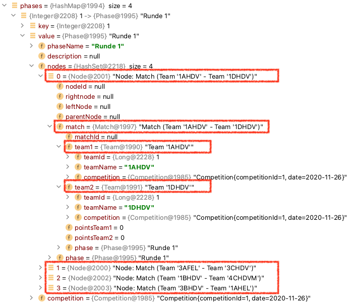
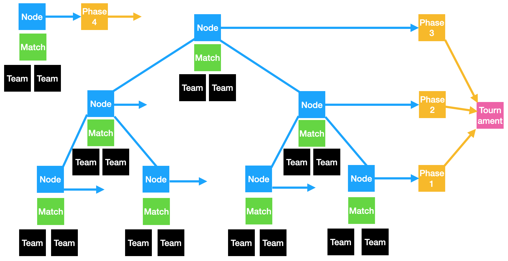

### Leo Competition

https://htl-leonding-project.github.io/leo-competition/

Im test-Folder befindet sich Prototyp.java

- Phase 1 wurde bereits implementiert.
- Es sind die weiteren Phasen fertigzustellen
    
## Projektablauf

### Turniervorbereitung

- Anmelden der Teams -> im Prototyp erstellen der einzelnen Teams Objekte
- Auswahl des Spielsystems(im Prototyp KO-System)

### Turnierdurchführung
- Zuweisen der Teams zu Matches
- Durchführen der einzelnen Runden
- Während des Turniers
  - anzeigen der nächsten Spiele
  - anzeigen der vergangenen Spiele und des Platzes an dem diese stattfinden

### Turnierauswertung

- Anzeige der Platzierung

## Zwei Prototypen

- k.o.-System
- zuerst Vorrunde und anschließend k.o.-Sytsem